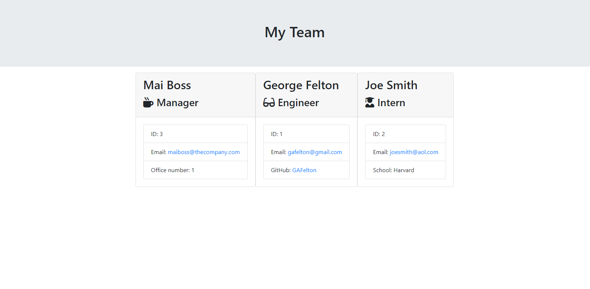

# Team Page Generator

  

  ## Description:

  An interactive team page generator on the Command Line, made using Node.js and the Inquirer npm package. This program will generate a Bootstrap html page displaying a card for each employee entered. Each card contains summary information, including Name, ID, Email, Role, and one role-specific detail.

[Link to GitHub Repo](https://github.com/GAFelton/team-page-generator-8)

  

  ## Table of Contents

 * [Installation](#Installation)

 * [Usage](#Usage)

 * [Contributing](#Contributing)

 * [Tests](#Tests)

 * [Questions](#Questions)

 * [License](#License)

  

  ## Installation

1. Fork the repo. 
2. Clone it locally. 
3. `npm install`.
4. `node app.js`.

  

  ## Usage

  The program will ask you simple questions to generate each employee card based on three role types: Manager, Engineer, and Intern.

[Demo Video Link](https://drive.google.com/file/d/15qsqtER9H-os5Jq-vDdXTErYnyNMHLIp/view)

  ## License

  MIT

  

  ## Contribution Guidelines

  Pull Requests are welcome!

  

  ## Questions

  Please address questions to GAFelton.

  [Link to Profile](https://github.com/GAFelton)

  [E-mail](mailto:64555318+GAFelton@users.noreply.github.com)
